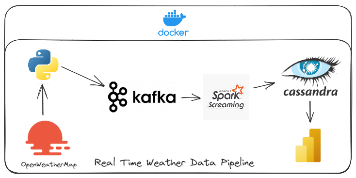

# `Real Time Weather` Data Pipeline

**`Project Architecture :`**

 **`Problem Statement`** :

- 🎯 **`Business Goal`** : 

- 📫 Feel free to contact me if anything is wrong or if anything needs to be changed 😎!  **medhajjari9@gmail.com**

